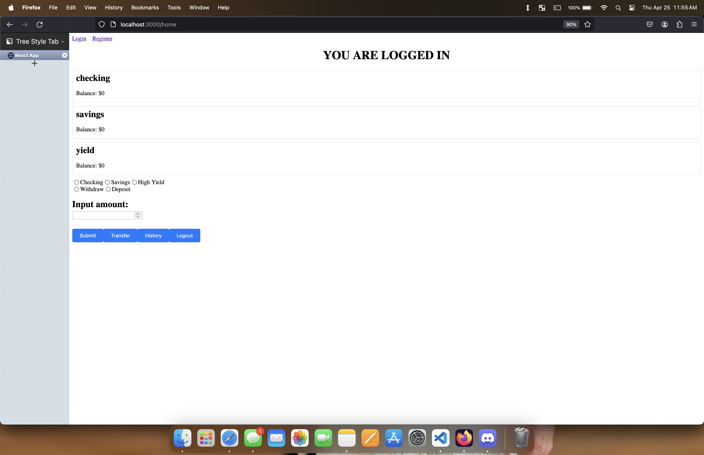

# Banking App

## Context

My team and I were tasked with creating a rudimentary banking app. The goal was for a user to log in to their account, and make modifications to their individual bank accounts. The user is able to deposit, withdraw, and transfer funds. They are also able to iew a history of all of their transactions.

## Content

Users are able to log in, and use the functionalities described above. The UI is very rudimentary, but that can be improved upon. 

## Technologies

- Sessions/Cookies
- React.js
- Node.js
- MongoDB

## Contribution

This was the first project my team and I started, so organizationally things were a little chaotic. After a bit of working in both the frontend and the backend, I ended on the role of creating some of the routes to be utilized when sending and receiving data from the database.
