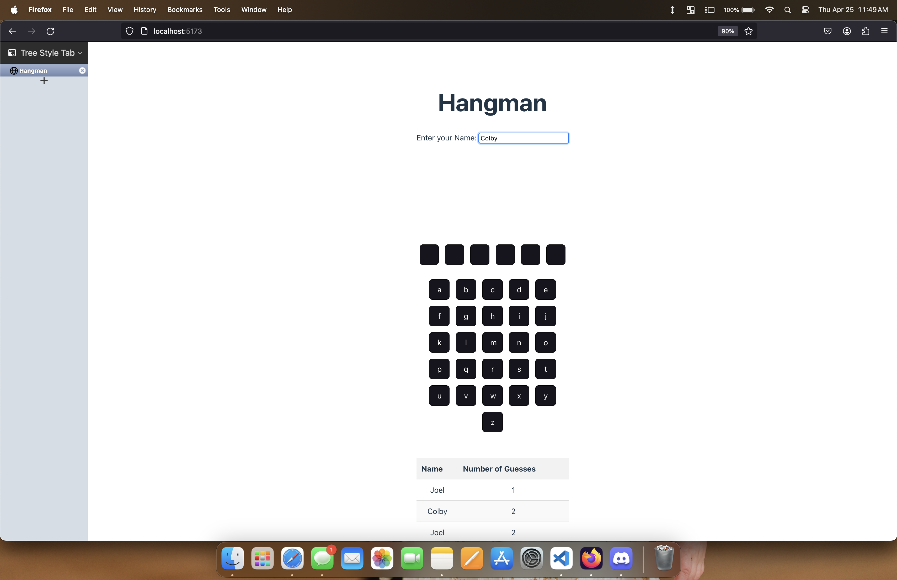
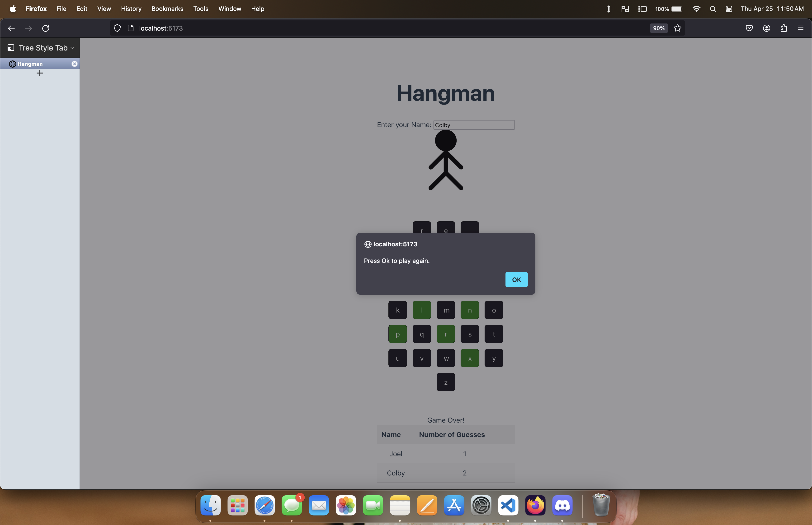

# Hangman

## Context

My team and I were tasked with creating the well known game Hangman. The player is given a number of blank spaces representing an unknown word and the player must guess letters that are inside said word.

## Content

When the game opens the player is met with a series of boxes representing each letter of the unknown word. They are also given an array of boxes each with a letter of the alphabet. The player must then select one of those letters in hopes that the letter belongs inside the word. Whether the player wins or loses their game state is sent to a database and returns a history of some of the high scores games based on the number of letters in their word.

## Technologies

List the technologies or tools used in the project. This can include programming languages, frameworks, libraries, databases, etc.

- React.js
- Node.js
- MongoDB

## Contribution

I was tasked with setting up the backend logic that allowed the user to select a letter while not having the unknown word hidden on the front end. What a team member and I did was stored a word on the backend, and when a letter was sent back to us, if the letter was in the word, we sent back a new set of underscores with the correct letter in the correct space in the array of underscores.

